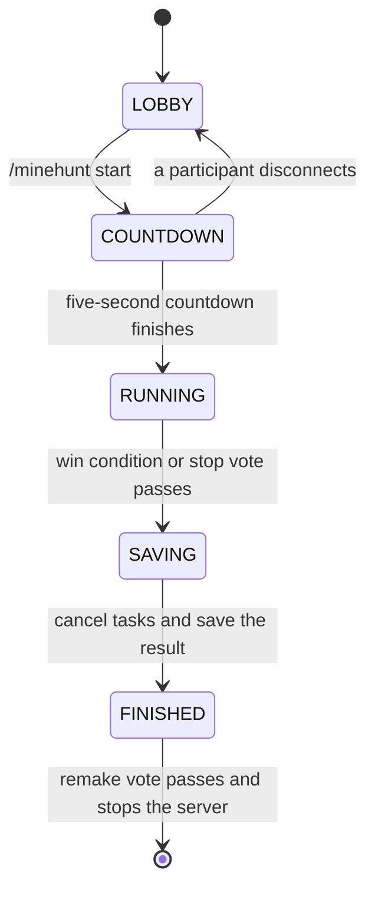

# MinehuntF game flow

[简体中文](../zh-CN/README.md) · [Documentation home](../README.md)

MinehuntF hosts one game session per server process. The game manager owns the shared lifecycle, while the selected mode owns its roles, rules, win conditions, and in-game events.

The plugin registers both [Manhunt](modes/manhunt.md) and [Bingo](modes/bingo.md). Manhunt is selected on startup, and an operator may switch modes in the lobby.

## Flow overview

### 1. Lobby (LOBBY)

- On startup, the plugin initializes storage, creates the selected mode, and registers that mode's own event listener.
- A joining player is placed in Adventure mode and assigned the mode's spectator role by default.
- Players can select roles and inspect or change the current mode's rules.
- The current implementation selects Manhunt on startup; an operator may use `/minehunt mode <mode>` to switch modes.
- When a mode is switched or closed, the manager unregisters its event listener before releasing the mode's resources.
- Players may start a remake vote. Its voter list is all players online when the vote starts; it passes at 50% within 30 seconds.

### 2. Start countdown (COUNTDOWN)

- `/minehunt start` first asks the selected mode to validate its start requirements.
- A successful validation begins a five-second countdown.
- Roles and rules cannot be changed during the countdown.
- If a participant disconnects during the countdown, it is cancelled and the game returns to the lobby.

### 3. Running game (RUNNING)

- When the countdown finishes, the system snapshots the online participants and creates the active session.
- The selected mode initializes roles and takes ownership of in-game events, mode tasks, and win detection.
- Returning participants recover their original identity; players outside the session join as spectators.
- The selected mode explicitly owns its scheduled tasks, and the manager asks it to cancel them when the game ends.
- The mode collects mode-specific data while running and builds one immutable complete record snapshot when it ends.
- Non-eliminated participants may start a stop vote. Its voter list is fixed when it starts; 80% within 30 seconds ends the game as stopped with no winner.

### 4. Saving (SAVING)

- Reaching a mode win condition or passing the stop vote begins the saving phase.
- The manager stops all per-game tasks and cancels an unfinished stop vote.
- The selected mode displays its result, restores player state, and builds the final game and player records.
- The final record is written on a dedicated thread. A failed or timed-out database write falls back to a local file before the session becomes finished.

### 5. Finished (FINISHED)

- The finished session no longer accepts gameplay events.
- Players may start a remake vote. If 50% of all online players vote within 30 seconds, the server stops after five seconds.
- The current version has no command that returns directly from `FINISHED` to a fresh lobby. Automatic remakes require a launcher or process supervisor to restart the stopped server.

## Shared commands

The main command is `/minehunt`; `/mh` is its alias.

| Command | Available phase | Purpose |
| --- | --- | --- |
| `/minehunt help` | Any | Show command help. |
| `/minehunt mode [mode]` | Any to inspect; lobby to switch | Show the current mode; an operator may select a registered mode. |
| `/minehunt join <role>` | Lobby | Join a role exposed by the selected mode. |
| `/minehunt leave` | Lobby | Join the selected mode's spectator role. |
| `/minehunt rule <rule>` | Any | Inspect one rule from the selected mode. |
| `/minehunt rule <rule> <value>` | Lobby | Change one rule from the selected mode. |
| `/minehunt start` | Lobby | Validate the selected mode and begin the countdown. |
| `/minehunt stop` | Running | Vote as a participant to stop the session. |
| `/minehunt give <item>` | Mode-defined | Obtain a special item exposed by the selected mode. |
| `/minehunt remake` | Lobby or finished | Vote to stop and restart the game server. |
| `/minehunt reload` | Any | Reload configuration; a player must be an operator. |

## Mode documentation

- [Manhunt](modes/manhunt.md) — implemented and selected at plugin startup.
- [Bingo](modes/bingo.md) — implemented as a standard red-versus-blue 5×5 item race.
