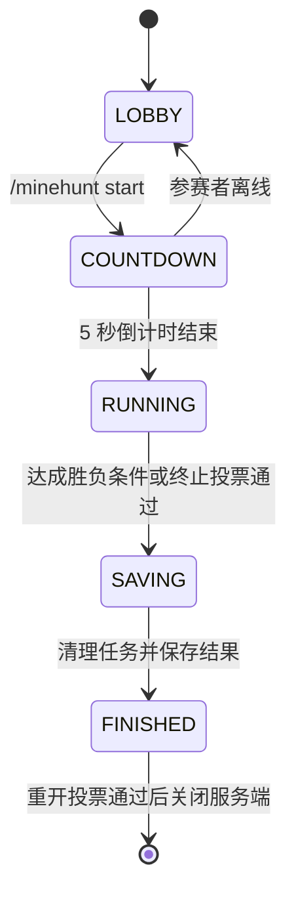

# MinehuntF 游戏流程

[English](../en-US/README.md) · [文档首页](../README.md)

MinehuntF 在一台服务端中维护一局游戏。通用流程由游戏管理器负责，角色、规则、胜负条件和模式内事件由当前模式负责。

插件注册了 [Manhunt 模式](modes/manhunt.md)和 [Bingo 模式](modes/bingo.md)，启动时默认选择 Manhunt；管理员可以在准备阶段切换模式。

## 流程概览

### 1. 准备阶段（LOBBY）

- 插件启动后初始化存储并创建当前模式，同时注册该模式自己的事件监听器。
- 玩家加入时进入冒险模式，并默认加入当前模式的观众角色。
- 玩家可以选择角色、查看或修改当前模式规则。
- 当前实现会在启动时自动选择 Manhunt；管理员可以使用 `/minehunt mode <mode>` 切换模式。
- 切换或关闭模式时，游戏管理器会先注销该模式的事件监听器，再释放模式资源。
- 可以发起重开投票。投票名单为发起时的全部在线玩家，30 秒内达到 50% 即通过。

### 2. 开始倒计时（COUNTDOWN）

- 执行 `/minehunt start` 后，当前模式先检查是否满足开始条件。
- 检查通过后开始 5 秒倒计时。
- 倒计时期间不能重新选择角色或修改规则。
- 若参赛角色中的玩家在倒计时期间离线，倒计时会取消并返回准备阶段。

### 3. 游戏进行（RUNNING）

- 倒计时结束时，系统记录当前在线参赛者并创建本局会话。
- 当前模式接管角色初始化、游戏事件、专用任务和胜负判断。
- 参赛者重新上线时恢复原有身份；不属于本局的玩家以观众身份加入。
- 当前模式显式持有本局定时任务，结束时由游戏管理器通知模式统一取消。
- 模式在运行期间收集模式专属数据，并在结束时生成不可变的完整记录快照。
- 尚未淘汰的参赛者可以发起终止投票。投票名单在发起时确定，30 秒内达到 80% 即以“已终止”结束，且没有胜者。

### 4. 保存结果（SAVING）

- 达成模式胜负条件或终止投票通过后进入保存阶段。
- 系统停止本局任务并取消仍在进行的终止投票。
- 当前模式展示结果、恢复玩家状态并生成最终对局及玩家记录。
- 最终记录在独立线程中写入数据库；数据库失败或超时后回退保存到本地文件，随后进入结束阶段。

### 5. 已结束（FINISHED）

- 本局不再接受游戏内事件。
- 可以发起重开投票；30 秒内达到全部在线玩家的 50% 后，服务端将在 5 秒后关闭。
- 当前版本没有从 `FINISHED` 直接返回新准备阶段的命令。若需自动重开，应由启动脚本或进程管理器在服务端关闭后重新启动它。

## 通用命令

主命令为 `/minehunt`，别名为 `/mh`。

| 命令 | 可用阶段 | 说明 |
| --- | --- | --- |
| `/minehunt help` | 任意 | 显示命令帮助。 |
| `/minehunt mode [mode]` | 任意查看；准备阶段切换 | 查看当前模式；管理员可切换已注册模式。 |
| `/minehunt join <role>` | 准备阶段 | 加入当前模式提供的角色。 |
| `/minehunt leave` | 准备阶段 | 加入当前模式的观众角色。 |
| `/minehunt rule <rule>` | 任意 | 查看当前模式的一项规则。 |
| `/minehunt rule <rule> <value>` | 准备阶段 | 修改当前模式的一项规则。 |
| `/minehunt start` | 准备阶段 | 校验当前模式并开始倒计时。 |
| `/minehunt stop` | 游戏进行中 | 参赛者投票终止本局。 |
| `/minehunt give <item>` | 由模式决定 | 获取当前模式提供的特殊物品。 |
| `/minehunt remake` | 准备阶段或已结束 | 投票关闭并重启游戏服务端。 |
| `/minehunt reload` | 任意 | 重新加载配置；玩家执行时需要 OP。 |

## 模式文档

- [Manhunt](modes/manhunt.md) — 已实现并在插件启动时启用。
- [Bingo](modes/bingo.md) — 已实现红蓝两队的标准 5×5 物品连线玩法。
